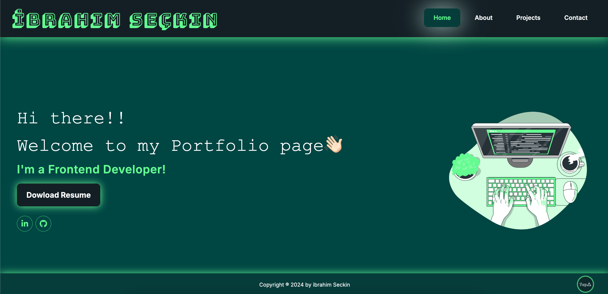

<a name="readme-top"></a>
  
 
<!-- PROJECT LOGO -->
<br />
<div align="center">
  <a href="https://github.com/ibrsec/portfolio-next-ts/">
    
  </a>

  <h3 align="center">Portfolio App | Typescript Next</h3>

  <p align="center">
    An awesome Portfolio App
    <a href="https://github.com/ibrsec/portfolio-next-ts"><strong>Explore the docs »</strong></a>
    <br />
    <br />
    <a href="https://ibrahimseckin-portfolio.vercel.app/">View Demo</a>
    ·
    <a href="https://github.com/ibrsec/portfolio-next-ts/issues">Report Bug</a>
    ·
    <a href="https://github.com/ibrsec/portfolio-next-ts/issues">Request Feature</a>
  </p>
</div>


<!-- TABLE OF CONTENTS -->
<details>
  <summary>📎 Table of Contents 📎 </summary>
  <ol>
    <li><a href="#about-the-project">About The Project</a></li>
     <!-- <li><a href="#figma">Figma</a></li> -->
     <li><a href="#overview">Overview</a></li>
     <li><a href="#quick-setup">Quick Setup</a></li>
     <li><a href="#directory-structure">Directory structure</a></li>
     <li><a href="#built-with">Built With</a></li>
    <!-- <li>
      <a href="#getting-started">Getting Started</a>
      <ul>
        <li><a href="#prerequisites">Prerequisites</a></li>
        <li><a href="#installation">Installation</a></li>
      </ul>
    </li>
    <li><a href="#usage">Usage</a></li>
    <li><a href="#roadmap">Roadmap</a></li>
    <li><a href="#contributing">Contributing</a></li>
    <li><a href="#license">License</a></li>
    <li><a href="#contact">Contact</a></li>
    <li><a href="#acknowledgments">Acknowledgments</a></li> -->

    
  </ol>
</details>


---

<!-- ABOUT THE PROJECT -->
<a name="about-the-project"></a>
## ℹ️ About The Project
  
[](https://ibrahimseckin-portfolio.vercel.app/) 


 

<p align="right">(<a href="#readme-top">back to top</a>)</p>


---

<!-- ## Figma 

<a href="https://www.figma.com/file/ePyCHKsx2ODB32uLgyUEEd/bootstrap-home-page?type=design&node-id=0%3A1&mode=design&t=edDzadCB9Ev5FS1a-1">Figma Link</a>  

  <p align="right">(<a href="#readme-top">back to top</a>)</p>


--- -->
<a name="overview"></a>
## 👀 Overview

 
<b>🚀 Next.js with TypeScript:</b> Developed a modern, responsive portfolio website using Next.js and TypeScript to showcase professional skills, projects, and contact information with fast performance and seamless navigation.</br>

<b>🎨 Tailwind CSS Styling:</b> Utilized Tailwind CSS for a clean and customizable UI design, ensuring a visually appealing and consistent user experience across all devices.</br>

<b>🗂 Project Showcase:</b> Organized projects by technology stack, providing detailed descriptions and links to GitHub repositories, demonstrating versatility in various frameworks and libraries.</br>

<b>🔗 Dynamic Pages & Integration:</b> Designed key sections like 'Home' with a resume download feature, 'About' linking directly to LinkedIn, and 'Contact' with a fully functional contact form, enabling easy communication and networking.</br>

<b>🛠 State Management & UI Enhancements:</b> Employed React and Redux Toolkit for state management and React Toastify for real-time notifications, enhancing interactivity and user feedback.</br>


<b>🌐 Optimized Deployment:</b> Prepared for scalable deployment, ensuring high performance and availability for a global audience.</br> 
<!-- 🌱 ÷Screen and search the Legends on the app</br> -->
<!-- 💪   </br> -->
<!-- 🐞 Check the finished tasks   </br> -->


<p align="right">(<a href="#readme-top">back to top</a>)</p>


<a name="quick-setup"></a>
## 🛫 Quick Setup

```sh
# clone the project
git clone https://github.com/ibrsec/portfolio-next-ts.git

# enter the project directory
cd portfolio-next-ts

# install dependency
npm install || yarn install

# develop
npm run dev || yarn start
```

<p align="right">(<a href="#readme-top">back to top</a>)</p>


<!-- ## 🐞 Debug

 -->


<a name="directory-structure"></a>
## 📂 Directory structure 

```diff
portfolio-next-ts  (folder)
  |          
  |---public (folder) 
  |                
+ |---src (folder)    
  |     |---app (folder)          
  |     |    |---api (folder)         
  |     |    |   └---todos (folder) 
  |     |    |         |---[id] (folder) 
  |     |    |         |     └---route.ts 
  |     |    |         |
  |     |    |         |---data.ts
  |     |    |         └---route.ts
  |     |    |        
  |     |    |---global.css 
  |     |    |---layout.tsx
  |     |    └---page.tsx
  |     |            
  |     |            
  |     |---dbConfig (folder)   
  |     |           
  |     |          
  |     └---types.d.ts 
  |         
  |---next.config.mjs 
  |---postcss.config.mjs
  |---tailwind.config.ts
  |---.eslintrc.json  
  |----tsconfig.json
  |----package.json
  |----yarn.lock
  └----readme.md 
```

<p align="right">(<a href="#readme-top">back to top</a>)</p>

---

<a name="built-with"></a>
### 🏗️ Built With

 
<!-- https://dev.to/envoy_/150-badges-for-github-pnk  search skills-->

 
  
  
 <!--   -->
  
 <!--   -->
 <!--   -->
 <!--   -->
  
  
  
 <!--   -->
  
 
